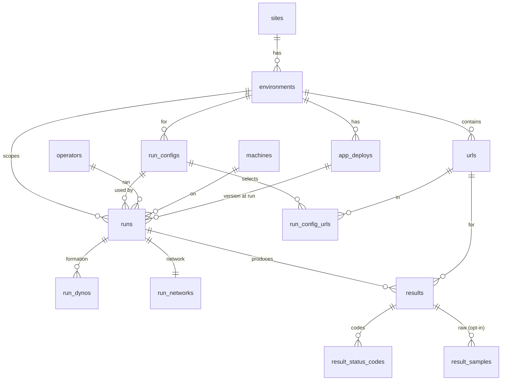

# Data model

thunderherd stores every run and its full metrics **plus the exact context it ran
in**, so results are analysable long after the terminal is closed. Schema:
[`db/schema.rb`](schema.rb) (migrations in `db/migrate/`).

## Diagram

## Tables

| Table | Purpose |
|---|---|
| `sites` | A project/app under test (`key`, `name`). |
| `environments` | A `(site, env)` target: `base_url`, optional `heroku_app`, `is_production`. |
| `urls` | The URLs to hit: `method`, `path`, optional JSON `body`, `is_active`. |
| `run_configs` (+ `run_config_urls`) | Reusable load configs: requests/URL, concurrency, timeout, and which URLs. |
| `runs` | One execution: load params, `status`, `label`, `is_baseline`, tool + harness version, timestamps. |
| `results` | Per-URL metrics for a run — `rps`, `error_count`/`error_rate`, min/avg/p50/p90/p95/p99/max, std-dev, dns/connect/server/transfer. |
| `result_status_codes` | Status-code distribution per result (`0` = connection failure). |
| `result_samples` | Optional raw per-request rows (opt-in; high volume) for true histograms. |
| `run_dynos` | Heroku dyno formation at run time (one row per process type). |
| `run_networks` | The engineer's network context (kind, ISP, downlink, RTT). |
| `app_deploys` | The deployed version (`heroku_release`, `git_sha`) — deduped, shared by many runs. |
| `operators`, `machines` | Who ran a test, and on what computer. |

A Scenic view — `v_run_summary`, one row per run with its context and aggregates —
backs the read-only `VRunSummary` model that the runs list and dashboard read.

## Design notes

- Every metric is per `(run, url)` in `results`; history is "more runs".
- `runs.is_baseline` marks the run you compare against; toggle it from the runs list.
- `run_dynos` is normalized so you can filter/group by formation — e.g. only
  compare runs where `web = 2×Standard-2X`.
- `run_networks.public_ip_cidr` is a **coarsened (/24) or NULL** value — never the
  raw IP. Keep the DB access-controlled; `operators.email` is internal PII.
